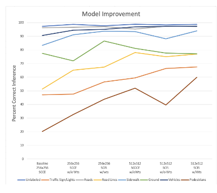
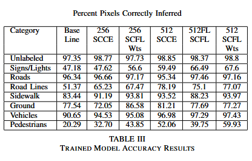

# Semantic Segmentation for a Self Driving Vehicle

For the WPI graduate RBE549 Computer Vision course, our group chose semantic segmentation as our challenge. We utilized the CARLA car simulator, automating it to collect thousands of labeled images for semantic segmentation. This repository contains the code, models, examples, and reports of the project.

In the end, we utilized a U-Net model trained with a sparse categorical cross entropy focal loss to adjust for a heavily imbalanced categorical representation and dataset balance.

The performance of included models as we experimented with hyperparameters and loss methods are in the report and below:

